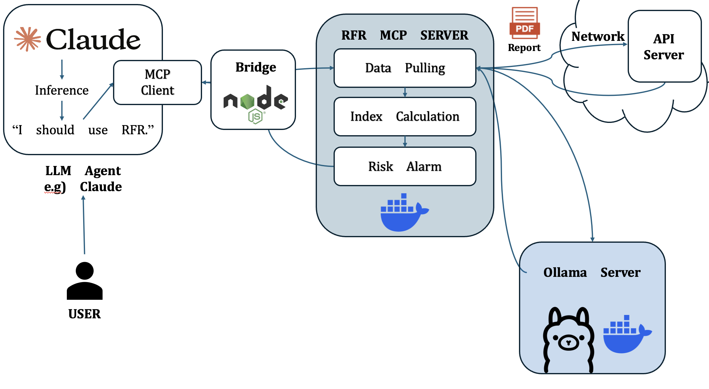

<p align="center">
  
</p>

RunFromRun은 스테이블코인의 **오프체인 준비금(Reserve) 리스크**와 **온체인 시장/행동 리스크**를 통합해서  
**FRRS / OHS / TRS**를 계산하는 **MCP(Model Context Protocol) 서버**입니다.

이 서버는 Docker Compose를 통해 쉽게 배포되며, 기본적으로 로컬에서 실행되는 Ollama LLM을 사용해 PDF 표 추출 및 LLM voting을 수행합니다.  
온체인 시장 데이터는 CoinGecko Demo API를 이용하여 최신 가격·시총·거래량 정보를 가져옵니다.

---

## 핵심 기능

### 1) 오프체인 준비금 분석 (PDF → AssetTable)
1. 발행사 PDF 보고서를 다운로드합니다.
2. PDF의 hash 값을 이용하여, 마운트 된 디렉토리에 기존에 캐시된 결과가 있는지 확인합니다.
3. 만약 로그에 hash 값이 존재한다면, 캐시 디렉토리에서 AssetTable을 곧바로 가져옵니다.
4. Camelot/Tabula를 이용해 표를 추출합니다.
5. 추출한 표를 여러 방식으로 가공합니다. (CUSIP 번호를 OPENFIGI를 통해 해석하는 과정도 포함합니다)
6. 여러 LLM 모델이 투표 방식으로 추출 데이터를 표준 스키마(`AssetTable`)로 정규화합니다.
7. 합계가 맞지 않는 경우 `correction_value` 필드에 차이를 넣어 신뢰도를 보정합니다.

### 2) 온체인 지표 수집
* 체인별 **유통량(circulating supply)** 수집 및 합산  
  (지원 체인: `ethereum`, `base`, `binance‑smart‑chain`, `arbitrum-one`, `solana`, `tron`, `sui`)
* 가격/시총/거래량 시계열(최근 31일)
* 고래 집중도(holder distribution)
* DEX StableSwap 기반 슬리피지 시뮬레이션(뉴턴–랩슨 수치해법으로 계산)

### 3) 리스크 지수 계산
* **FRRS (Final Reserve Risk Score)** – 오프체인 준비금 건전성  
  - `RQS` 준비금 품질 점수 (자산 비중 × 유동성 점수)  
  - `TA_score` 투명성 보정 (CUSIP 공개 여부에 따른 가중치)  
  - `SA_score` 안정성 보정 (과담보율 로그 스케일)  
  - `Collateralization Ratio` = 준비금 총액 / 총 발행량 비율

* **OHS (On‑Chain Health Score)** – 온체인 시장/행동 리스크  
  - `PMCS` 1차시장 신뢰 (유통량 축소 이상치 검출)  
  - `HCR` 고래 집중도 리스크 (체인별 top‑50 지갑 집중도)  
  - `SMLS` DEX 유동성 (StableSwap 슬리피지, top‑20 풀에 해당 코인이 없으면 100% 슬리피지로 간주, DEX는 유동성이 부족한 경우 SMLS는 값이 튈 수도 있음)

* **TRS (Total Risk Score)** – FRRS와 OHS를 시간 경과에 따라 가중 결합  
  - 최신 보고서는 FRRS 비중이 높고, 시간이 지날수록 OHS 비중을 높입니다.  
  - 180일을 지나면 보고서가 만료로 간주되어 TRS는 OHS와 동일해집니다.

### 4) Summary/Alarm 생성
각 지수가 설정된 임계치를 넘거나 떨어질 때 자동으로 요약과 경고 메시지를 생성하여 `analysis` 필드에 저장합니다.
만일 Slack webhook url이 제공되어 있는 경우, Slack으로 알림으로 보냅니다.

---

## 아키텍처

아래는 사용자의 요청부터 최종 리스크 점수(`TRS`)를 계산하기까지의 전체 데이터 흐름 및 모델 아키텍처입니다.



---

## 프로젝트 구조

- `docker-compose.yml` – MCP 서버와 Ollama 컨테이너를 정의합니다.
- `.env.example` – 환경변수 템플릿입니다. 실행 전 `.env`로 복사하여 값을 채워야 합니다.
- `touch_mount_dir.sh` – 호스트에 PDF 캐싱용 마운트 디렉토리를 만드는 스크립트입니다(이 스크립트로 생성된 경로를 환경변수에 잘 입력해야 오류가 발생하지 않습니다).
- `common/schema.py` – 입력/출력 데이터 클래스(`CoinData`, `OnChainData`, `Indices`, `RfRResponse` 등)를 정의합니다.
- `claude_desktop_entrypoint.sh` – Claude Desktop에서 MCP 서버를 자동으로 구동하고 연결하는 스크립트입니다.

---

## 사전 준비

### 1) PDF/결과 캐싱 디렉토리 생성

프로젝트 루트에서 다음을 실행하여 호스트의 캐싱용 디렉토리 생성합니다:

```bash
chmod +x touch_mount_dir.sh
./touch_mount_dir.sh
```

기본 생성 위치는 `$HOME/rfr_pdf_results`이며 다음과 같은 구조가 생성됩니다:

```
~/rfr_pdf_results/
  asset_tables/
  pdfHash_id.log
```

`docker-compose.yml`에서는 이 경로를 컨테이너 내부의 `/rfr/pdf_results` 에 마운트합니다.

### 2) Ollama 모델 마운트

로컬에서 Ollama를 설치하고 필요한 모델을 다운받아 두어야 합니다.  
`docker-compose.yml`의 `ollama` 서비스에서 다음처럼 볼륨을 마운트합니다:

```yaml
ollama:
  image: "ollama/ollama:latest"
  volumes:
    - /path/to/your/.ollama:/root/.ollama
```

위의 `/path/to/your/.ollama`는 호스트에서 모델 파일이 저장된 폴더로 교체합니다.  
컨테이너 쪽의 `/root/.ollama`는 고정입니다.

### 3) 환경변수 설정

`.env.example`을 복사하여 `.env` 파일을 만들고 값을 채웁니다:

```bash
cp .env.example .env
```

#### 필수 환경변수

- **CoinGecko API Key**  
  - `API_KEY_COINGECKO` 값은 반드시 채워야 합니다. Pro API 키를 사용하여 가격·시총·거래량 데이터를 가져옵니다.

#### 선택 항목

- `API_KEY_OPENAI` – 현재 파이프라인에서는 사용하지 않습니다.  
- `API_KEY_OPENFIGI` – CUSIP/FIGI 매핑 기능을 사용하려면 설정할 수 있습니다.

#### 그 외 자주 수정하는 항목

- LLM 옵션 및 모델:
  ```bash
  LLM_OPTION="local"            # 기본적으로 Ollama 사용
  OLLAMA_HOST="http://ollama:11434"
  OLLAMA_MODELS=['llama3.1:8b','phi4','gemma3:12b','deepseek-r1:14b']
  ```
- 체인 RPC URL:
  ```bash
  ETHEREUM="https://ethereum-rpc.publicnode.com"
  SOLANA="https://api.mainnet-beta.solana.com"
  ...
  ```
- Threshold:
  ```bash
  THRESHOLD_FRRS=70
  THRESHOLD_OHS=70
  THRESHOLD_TRS='[60,80]'
  ```
- PDF 추출 옵션:
  ```bash
  MOUNTED_DIR="/rfr/pdf_results"
  CAMELOT_MODE='{"USDC":"hybrid", "USDT":"lattice", ...}'
  ```

---

## 실행 방법

### Docker Compose 실행

이 프로젝트에서는 기본적으로 Claude desktop이 client로 docker를 자동으로 띄우는 것을 가정합니다.

컨테이너 실행:

```bash
docker compose up -d
```

기본 포트는 다음과 같습니다:

| 서비스         | 포트            |
|---------------|-----------------|
| MCP 서버      | `http://127.0.0.1:8000/mcp` |
| Ollama LLM    | `http://127.0.0.1:11434`    |

상태 확인:

```bash
docker ps
docker logs -f rfr_mcp_server
```

### Claude Desktop 연동

`claude_desktop_entrypoint.sh`를 실행하면 다음을 자동으로 수행합니다:

1. 프로젝트 디렉토리로 이동  
2. `docker compose up -d` 실행  
3. `npx mcp-remote`로 Claude ↔ MCP 서버 브릿지 연결

Claude 설정 예시(JSON):

```json
{
  "mcpServers": {
    "Stablecoin Risk Analyzer": {
      "command": "/Users/username/path/to/RunFromRun/claude_desktop_entrypoint.sh"
    }
  }
}
```

---

## 사용 예시

### 자연어 명령으로 분석하기 (Claude Desktop)

```
“USDT 최신 준비금 보고서를 분석해서 FRRS/OHS/TRS를 계산해줘.
보고서 URL은 여기야: https://example.com/tether_report.pdf”
```
필요시 Claude desktop의 다른 url 추출 MCP 서버를 이용해서 전체 워크플로우 체인을 완성할 수 있습니다.

위처럼 지시하면 MCP 서버가 자동으로 PDF를 분석하고 온체인 데이터를 수집해  
FRRS, OHS, TRS를 계산한 뒤 결과와 경고 요약을 응답합니다.

### HTTP(JSON-RPC) 호출 예시 (디버깅/테스트)

직접 HTTP 요청을 보내 테스트할 수도 있습니다.  
아래 예시는 `provenance.report_pdf_url`에 PDF URL을 넣어 실행한 예입니다:

```bash
curl -s http://127.0.0.1:8000/mcp \
  -H "Content-Type: application/json" \
  -d '{
    "jsonrpc": "2.0",
    "id": "example-1",
    "method": "analyze",
    "params": {
      "stablecoin_ticker": "USDT",
      "mcp_version": "v0.1.0",
      "provenance": {
        "report_issuer": "Tether",
        "report_pdf_url": "https://example.com/tether_report.pdf"
      }
    }
  }'
```

성공 시 다음과 같은 요약 응답을 받습니다(값은 예시입니다):

```json
{
  "jsonrpc": "2.0",
  "id": "example-1",
  "result": {
    "risk_result": {
      "indices": {
        "FRRS": {"value": 86.2},
        "OHS": {"value": 72.5},
        "TRS": {"value": 78.9}
      },
      "analysis": "Summary: FRRS above threshold; OHS within threshold; TRS below warning level. ..."
    },
    "err_status": null
  }
}
```

출력은 `RfRResponse.__str__` 덕분에 `print(resp)` 또는 로그에서 깔끔하게 확인할 수 있습니다.

---

## 지수 계산 개요

### FRRS (Final Reserve Risk Score)
오프체인 준비금 건전성을 0~100 점수로 표현합니다.  
`RQS` (준비금 품질 점수), `TA_score` (투명성 가산점), `SA_score` (안정성 가산점) 세 요소를 곱하여 계산하며,  
준비금이 고품질 자산에 집중되고 과담보가 클수록 높게 나옵니다.

### OHS (On‑Chain Health Score)
온체인 시장/행동 리스크를 0~100 점수로 표현합니다.  
`PMCS`(1차시장 신뢰), `HCR`(고래 집중도), `SMLS`(DEX 유동성)를 가중 합해 계산합니다.  
유통량이 감소하지 않고, 고래 집중도가 낮으며, DEX 슬리피지가 적을수록 높게 나옵니다.

### TRS (Total Risk Score)
FRRS와 OHS를 시간에 따라 가중 평균하여 최종 위험 점수를 계산합니다.  
최근에 발행된 보고서일수록 FRRS 비중을 높게, 오래된 보고서일수록 OHS 비중을 높게 적용합니다.  
180일 이후 보고서는 만료되어 TRS는 OHS와 동일해집니다.

---

## 트러블슈팅

### PDF 저장 오류
- `touch_mount_dir.sh`를 실행했는지 확인합니다.  
- `.env`의 `MOUNTED_DIR`가 `/rfr/pdf_results`로 설정되어 있는지 확인합니다.  
- 호스트에 해당 디렉토리가 존재하는지 확인합니다.

### Ollama 연결 오류
- Compose 내부 통신에서는 `OLLAMA_HOST="http://ollama:11434"`를 사용합니다.  
- 로컬에서 직접 테스트할 때는 `OLLAMA_HOST="http://localhost:11434"`로 변경합니다.
- 환경변수로 주입된 모델들은 호스트의 Ollama에서 다운되어 있어야하고, 도커 컴포즈 파일에 적절히 마운트 되어야합니다.
- `ollama` 컨테이너가 실행 중인지 확인합니다.

### CoinGecko API 오류
- `API_KEY_COINGECKO` 값이 Demo API 키인지 확인합니다.  
- `.env`에서 `COINGECKO_DEMO_API_URL`을 사용하고 있는지 확인합니다.  
- 제한 초과나 일시적 장애일 수 있으므로 잠시 후 재시도합니다.

### 체인 RPC 오류
- `.env`의 각 체인 RPC URL이 유효한지 확인합니다.  
- 특정 RPC에서 장애가 발생하면 다른 RPC 엔드포인트로 교체해 보세요.

---

## Docker 이미지

MCP 서버를 위한 Docker 이미지 최신 태그는 아래와 같습니다:

```
minuk0815/sentinelx:0.1.0
```

기본적인 Dockerfile도 루트 디렉토리에 존재하기 때문에, Settings.py에 존재하는 값 혹은 다른 .py 파일을 수정하여 직접 이미지를 빌드하여 사용해도 무방합니다.
단, 대부분의 클래스가 pydantic 모델을 상속하므로, 이 부분을 유의하여 스키마를 수정해야 합니다.

---

## License
추후 업데이트 예정입니다.